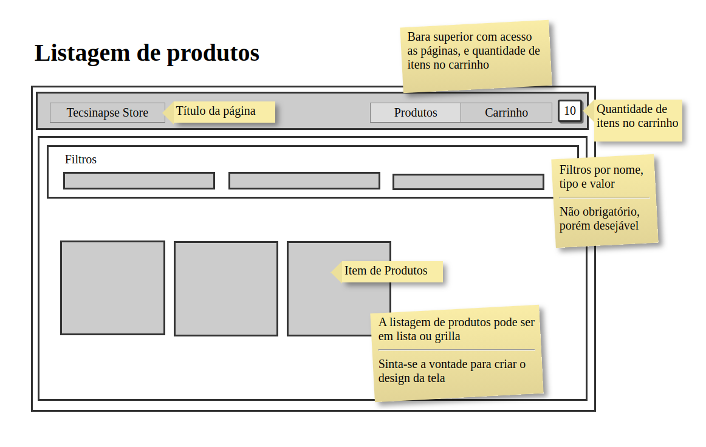
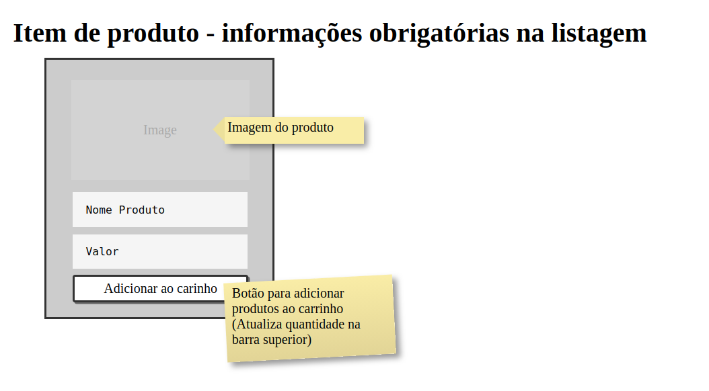
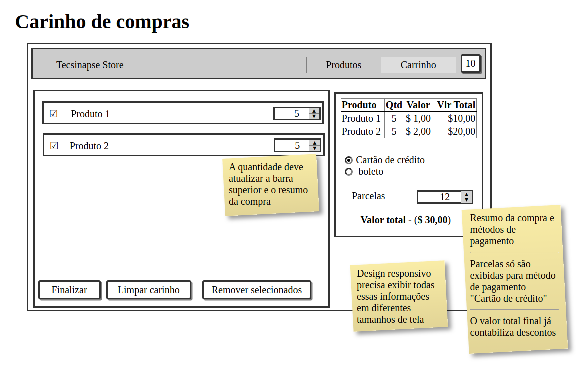

# Tecsinapse React Challenge

## Introdução

Bem-vindo ao desafio React da Tecsinapse!

Objetivo deste desafio é avaliarmos o seu domínio em Javascript, React e seu ecossistema.

Desde já te desejamos boa sorte!

## Desafio

### Avaliação:

A avaliação desafio consiste em quatro pontos de

- 1 - Conhecimento em Javascript, boas práticas de desenvolvimento e qualidade de código.
- 2 - Conhecimento em React, Manipulação de estados entre componentes React, bibliotecas e ecossistema.
- 3 - Design, interação e criatividade na criação de telas do sistema
- 4 - Coerência: Avalia se os requisitos foram atendidos

A Tecsinapse quer criar uma loja online para seus sistemas, e para isso precisamos que você crie uma loja em React, capaz de listar itens oriundos de um servidor Graphql e realizar sua compra.

Para isso, necessitamos de duas telas:

- 1 - Listagem de produtos
- 2 - carrinho de compra

### Requisitos funcionais

- **Listagem de produtos**: O usuário necessita ver uma listagem de produtos para poder adicioná-los ao carrinho, pode ser feita por listagem (exemplo tabela ou grilla). Cada item da listagem de produtos deve exibir obrigatoriamente: imagem do produto, nome e preço do produto, além de um botão para adicionar itens ao carrinho. O desenvolvedor pode desenvolver filtros para facilitar o acesso aos itens, não sendo obrigatório mas desejável. Sugestão de mockup segue abaixo;



- **Carrinho** O carrinho de compras exibirá dois componentes principais para o usuário visualizar e finalizar a compra, sugestão de mockup segue abaixo:

  - **Lista de itens adicionados ao carrinho**, cada item com sua quantidade, esta podendo ser aumentada ou diminuída diretamente no input, botões de seleção em cada item, sendo possível remover os produtos selecionados e também limpar todos os itens do carrinho, além de um botão de finalizar compra que irá exibir um alerta na tela com o valor final.
  - **Resumo da Compra**, será exibido um resumo da compra com:
    - Listagem de produtos com nome, valor, quantidade e valor total de cada produto;
    - Seleção de forma de pagamento (Boleto ou cartão), no caso cartão de crédito o sistema deve exibir um input de quantidade de parcelas.
    - Valor total da compra com descontos calculados.
    - O sistema deve calcular valor final dos produtos com descontos dependendo do modo de pagamento:
      - Opções de pagamento "boleto" tem 12% de desconto no total do carrinho.
      - Opções de pagamento "cartão de crédito" tem 5% de desconto, em até três vezes, no total do carrinho.





 - **Menu** O usuário necessita de uma barra superior contendo o acesso a cada tela e um campo em formato de emblema ou divisa com a quantidade total de itens no carrinho, toda e qualquer alteração na quantidade de itens no carrinho deverá ser refletida em tempo real na barra superior.

### Requisitos não funcionais

- Utilização de React :)
- Redux, Context API ou MobX para manipulação de estados
- Cliente Grapqhl, pode ser Apollo, Relay ou etc;
- Design Responsivo
- É obrigatório o uso de componentes do [Material-UI](https://github.com/mui-org/material-ui)
- É obrigatório o uso da biblioteca de Componentes da Tecsinapse [@tecsinapse/ui-kit](https://tecsinapse.github.io/ui-kit/) utilizando pelo menos algum componente.

### Diferenciais

- Persistir e Hidratar estados globais
- Design mobile
- Testes
- Lints

## Criando e submentendo sua solução 

Você deverá criar o projeto React do zero, o desenvolvedor pode utilizar uma ferramenta como [Create-React-App](https://create-react-app.dev/) e etc. Este projeto se comunicará com um servidor Graphql, este disponibiliza a listagem de produtos e operação de finalização, este está na pasta `server`.

O servidor Graphql roda na porta 4000, para utiliza-lo entre na pasta `server` e execute `yarn install && yarn start`.

Você deve recuperar a listagem produtos, esta está no seguinte formato:

```
query produtos {
  allProducts {
		id
        name
        desc
        iconUrl
        url
        license {
            name
        }
        price
        type
  }
}
```

Ao finalizar o carinho, você realizar uma chamada de finalização no servidor, para isso foi disponibilizada a mutation `finalizar`.


```
mutation finalizar {
  finalizar(carrinho)
}
```

O parâmetro `carrinho`, deverá conter os itens da compra, o valor total, e a forma de pagamento; a API segue a seguinte estrutura:

```
enum ProductType {
    CONCESSIONARIA
    MONTADORA
  }

  enum FormaPagamentoTipo {
    CARTAO
    BOLETO
  }

  type License {
    name: String
  }

  type Product {
    id: ID
    name: String
    desc: String
    iconUrl: String
    url: String
    license: License
    price: String
    type: ProductType
  }

  input ItemCompra {
    id: ID
    qtd: Int
  }

  input FormaPagamento {
    tipo: FormaPagamentoTipo
    parcelas: Int
  }

  input Carrinho {
    itens: [ItemCompra]
    valorTotal: Float
    formaPagamento: FormaPagamento
  }

  type Query {
    allProducts: [Product]
  }

  type Mutation {
    finalizar(carrinho: Carrinho): Boolean
  }
```

## Submetendo

Gostou do desafio? Se prepare e comece fazendo um Fork do projeto no github, você terá dois dias para concluir após o fork!

Crie uma branch, e após concluir faça um pull request com seu nome e sobrenome como título.

Garanta que seu projeto final estará com build (`yarn build`) em `/build` rodando bonitinho.

Qualquer dúvida em relação ao desafio, crie uma issue em nosso github.

Bom trabalho!
